# Credit_Risk_Analysis
## Overview of the Analysis and Purpose
This analysis is to use supervised machine learning to better understand credit risk. Credit risk is divided into low risk and high risk and then trained using 86 variables. I trained six different machine learning variables to model and analyze risk.

## Environment and Data
Environment - Python in Jupyter notebooks
Libraries - Numpy, Pandas, Pathlib, Collections, SciKit
ML Models -  Sklearn, Imblearn, Random Over Sampler, SMOTE, Random Under Sampler, SMOTEENN, Logistics Regression, Balanced Random Forest Classifier, Easy Ensemble Classifier with the ADA Boost Classifier

Data - The data used for this analysis comes from LendingClub, a peer-to-peer lending services company. The CSV file is available here (\Module-17-Challenge-Resources\LoanStats_2019Q1.csv). Loan status is the target variable and has one of two values; high risk or low risk. The original file has 86 columns, 85 of those will be used after they the data is set up for machine learning. This set will result in 95 independent variables. There are 115,675 original rows that, after data preparation, will result in 68,817 rows used for the analysis

## Steps and Results
### The Pipeline
A machine learning pipeline is created. This involves:
1. preparing the data.
2. Splitting the data into an independent variable that holds the 95 columns and a dependent variable holding the loan status.
3. The data is further split into X_train, X_test, y_train, y_test variables. This is necessary to have data to both train the model and then test the model.
4. The model is then fit. After fitting the data is tested. This is the prediction.
5. The results are shown in a number of ways.
#### Balanced Accuracy Scorecard
First a balanced accuracy score is produced. Sklearn describes this as "The**balanced accuracy**in binary and multiclass classification problems to deal with imbalanced datasets. It is defined as the average of recall obtained on each class. The best value is 1 and the worst value is 0 when adjusted=False". 
#### Confusion Matrix
A confusion matrix is produced. A confusion matrix, as shown in figure 1. This matrix is used to understand true vs false predictions.

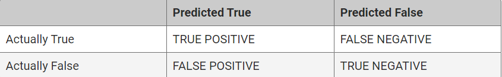
Figure 1

#### Classification Report
Finally a classification report is produced. The three main points in a classification report are the precision, recall (sensitivity) and the f1 score.
1. Precision is mathematically defined as True Positive (TP) / (TP + False Positive (FP)). This measures how accurate the model predicts the result.
2. Sensitivity (recall) is mathematically defined as TP / (TP + False Negative (FN)). This measures how well the model recognizes the indicated result. The more sensitive a model is the more complete the indicated result will be. This means the more false negatives the indicated result contains the less sensitive it is.
3. The f1 score is the harmonic mean. It is mathematically defined as 2x(precision x Sensitivity) / (Precision + sensitivity). This measure provides how well the model works balancing precision and sensitivity.

### Preparing the Data
The data was read into a data frame and then the following was done to prepare the data so that a machine learning model could be used on it.
1. Null columns were dropped
 2. Null rows were dropped
 3. Loan status "Issued" results were dropped
 4. Interest rate was cast to a float, a numerical value.
 5. The target column values were converted to low risk and high risk based on days late on payment.
 6.  get_dummies was used to convert string objects to numerical values. This increases the column count to 96 (including the dependent variable).
 7.  The data is split into dependent and independent variables. the independent variable "X" is populated and the dependent variable "y" is populated.
 8.  The data is split into X_train, X_test, y_train, y_test. Again, this is so we have data to train the model and then data to test and predict how well the model works. See figure 2.
 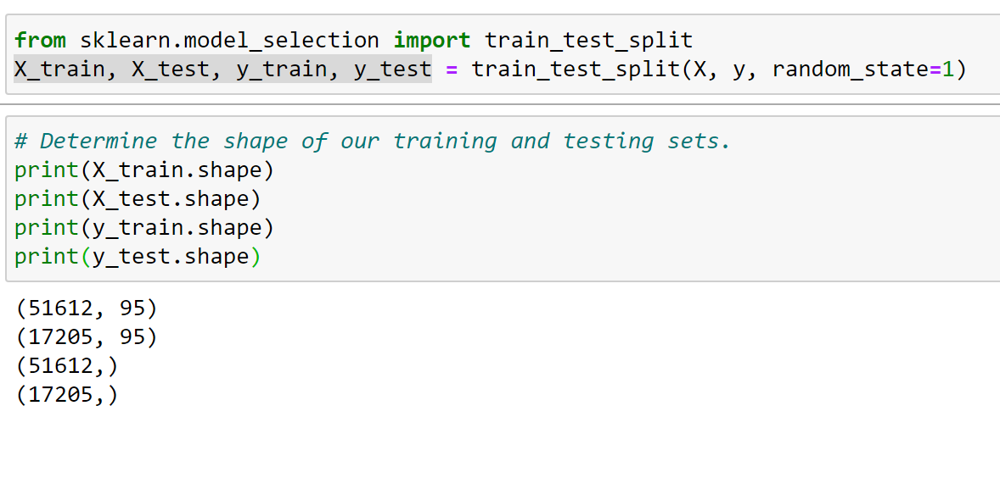

Figure 2
This is now the core data set that will be used in all of the following six models

### Naive Random Oversampling
naive Random Oversampling is used because the model is very imbalanced. That is, in looking at the y train variable, there are 51,366 low risk vs 246 high risk values. See figure 3 for the imbalance and the results of oversampling.
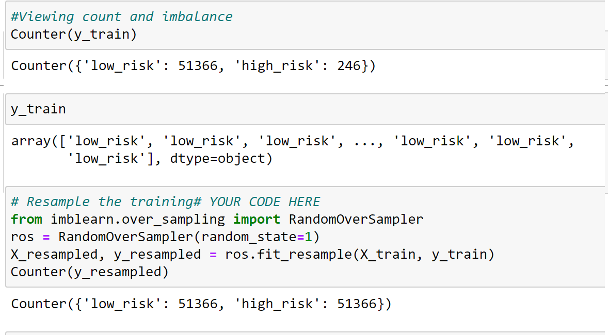
Figure 3

Next the logistics regression model is used on the resampled data to fit the data. This is followed with creating a prediction based on the y test and y pred variables. See Figure 4.
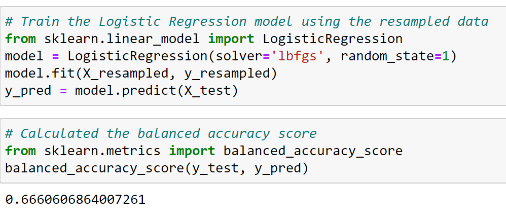
Figure 4

The balanced accuracy prediction is 0.67. This indicated a good, but not great fit.

This is followed by the confusion matrix and classification report. See figure 5.
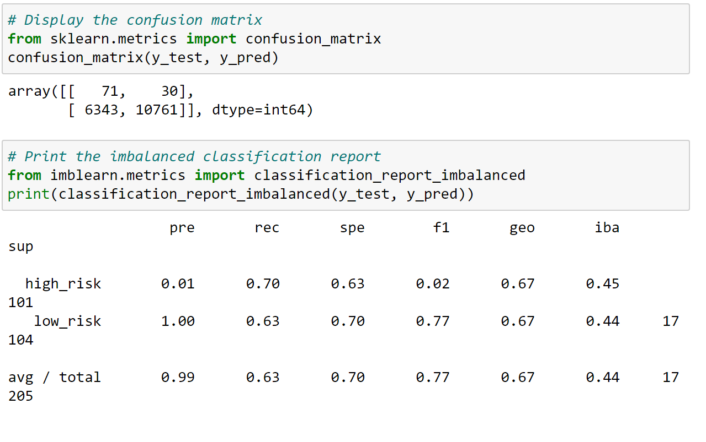
Figure 5
In the classification report the precision is 0.01. This is poor and can be seen in the confusion matrix. out of 101 true high risk indicators, the model picked 71 of those and also picked 6,343 as high risk that were false positives.
Sensitivity is good. It is 0.7. out of 17,104 truly low risk indicators, the model picked 10,716 correctly as negative and 30 incorrectly, false negatives. The f1 score is also low, 0.02. If sensitivity is more important then precision, this model will work fairly well but it will include many low risk loans in the high risk category.

### SMOTE Oversampling
SMOTE stands for Synthetic Minority Oversampling Technique, another over sampling method. Its based on oversampling where the closest neighbors of the minority class are chosen.
The data is resampled using the SMOTE sampling method. Then, the logistics regression model is used to fit the resampled data. Based on that the y_test and y_pred are used to make a prediction. the balanced accuracy sore, confusion matrix and classification report for this model are shown in figure 6.
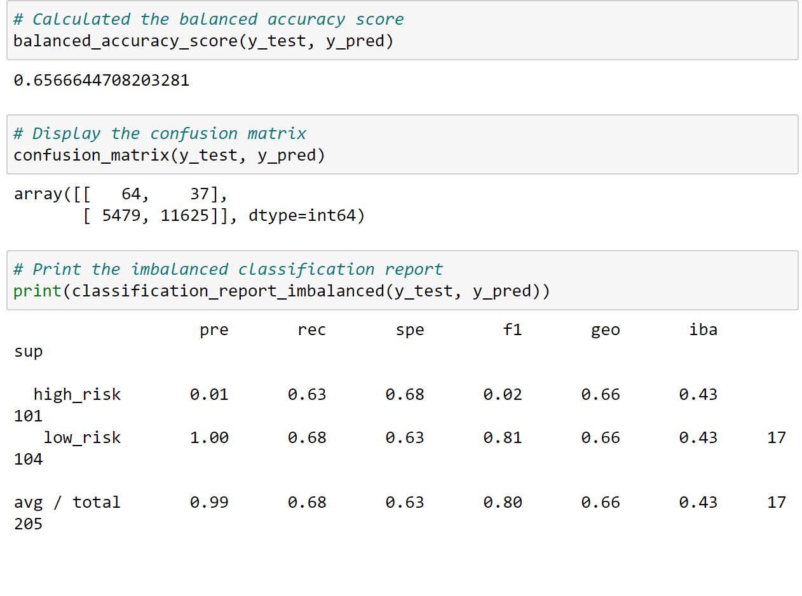
Figure 6
The rounded balanced accuracy score is 0.66. It is slightly lower than the Naive oversampling score. Looking at the classification report the precision is 0.01. This is poor and can be seen in the confusion matrix. out of 101 true high risk indicators, the model picked 64 of those and also picked 5,479 as high risk that were false positives.
Sensitivity is okay. It is 0.63. Out of 17,104 truly low risk indicators, the model picked 11,625 correctly as negative and 37 incorrectly, false negatives. The f1 score is also low, 0.02. Again, If sensitivity is more important then precision, this model will work fairly well but it will include many low risk loans in the high risk category. The Naive oversampling model is better than this SMOTE model due to the lower sensitivity score. 

### Under Sampling
Under sampling uses actual data as opposed to oversampling but results in a much smaller data set. This, in turn, can affect the validity of the model. In under sampling we end up with 246 high risk and 246 low risk values. See figure 7. This is should satisfy normality and the law of large numbers.
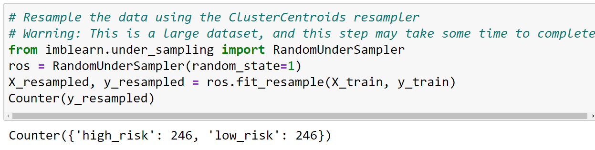
Figure 7

The results of using the logistic regression model with this under sampled set are shown in figure 8.
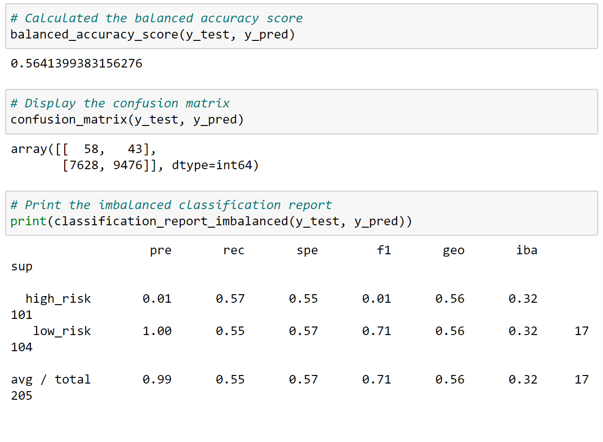
Figure 8
The rounded balanced accuracy score is 0.56. This is the best score so far.  Looking at the classification report the precision is still 0.01. This is poor and can be seen in the confusion matrix. out of 101 true high risk indicators, the model picked 58 of those and also picked 7,628 as high risk that were false positives.
Sensitivity is barely okay. It is 0.57. Out of 17,104 truly low risk indicators, the model picked 9,476 correctly as negative and 43 incorrectly, false negatives. The f1 score is also low, 0.01. Again, If sensitivity is more important then precision, this model could be used but it will include many low risk loans in the high risk category. Again, either of the oversampling models are better than this under sampling model.

### Combination Over and Under Sampling
SMOTEENN combines SMOTE, oversampling with nearest neighbors but then as a second step under samples the oversample. This second step helps remove outliers. After resampling using this SMOTEENN technique we end up the 68,458 high risk and 62,022 low risk samples. See figure 9.
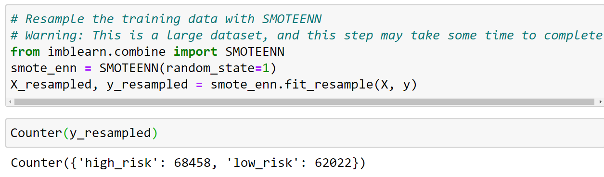
Figure 9

As before, the logistics regression model is then used to fit the data and then make a prediction. See figure 10.
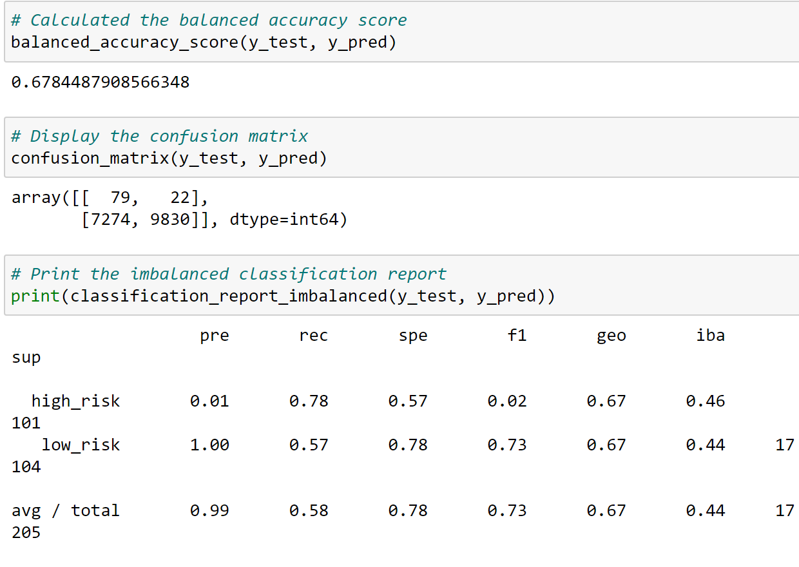
Figure 10
The rounded balanced accuracy score is 0.68. This is lower then wither of the two oversampling models. Looking at the classification report the precision is 0.01. This is poor and can be seen in the confusion matrix. out of 101 true high risk indicators, the model picked 79 of those and also picked 7,274 as high risk that were false positives.
Sensitivity is pretty good and the best so far. It is 0.78. Out of 17,104 truly low risk indicators, the model picked 9,830 correctly as negative and 22 incorrectly, false negatives. The f1 score is also better but still very low, 0.02. Again, If sensitivity is more important then precision, this model could be used but it will include many low risk loans in the high risk category. This is the best model so far. Though the precision score is still 0.01 the numbers are slightly better and the sensitivity score is much better.

### Balanced Random Forest Classifier
Now we will combine many weak learners to see if they are now strong learners using the balanced random forest classifier with 100 estimators. Sampling the data using the balanced Random Forest Classifier look at the y_train sample. Here the high risk is 246 and the low risk is 51,366. See figure 11.
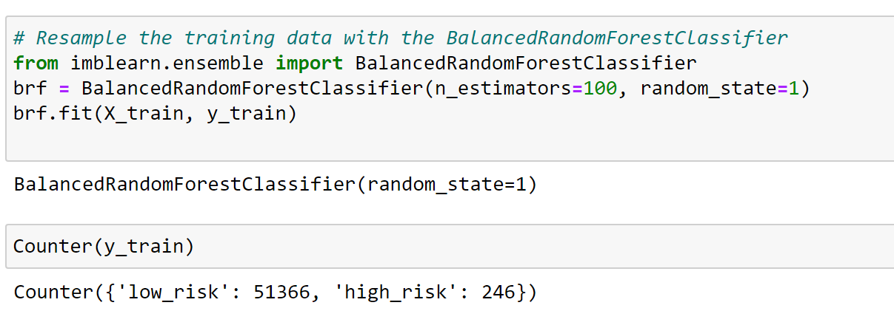
Figure 11
Before we make the prediction a note on the challenge 17 instructions. In challenge 17 deliverable 3, instructions steps 4 and 8 state "After the data is resampled, use the`LogisticRegression`classifier to make predictions and evaluate the model’s performance." To me this does not make sense to use the logistics regression since we trained the data with the balanced random forest classifier. Shouldn't we use the balanced random forest classifier to predict? I brought this up with the instructor and a TA. They agree. I do not know what communications have taken place between them and the graders but based on their instructions I'll use the balanced random forest to predict for step 4 and the easy ensemble adaboost for step 8.
The prediction is made and the scores from that prediction are shown in figure 12.
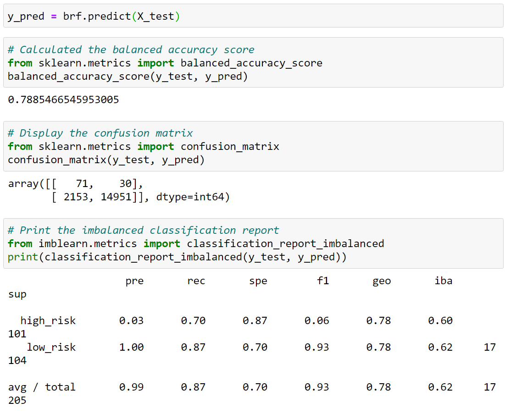
Figure 12
The rounded balanced accuracy score is 0.79. Now, this is the best score so far.  Looking at the classification report the precision has improved to 0.03. Though still low, it is much higher than any of the other models so far.  Looking at the confusion matrix, out of 101 true high risk indicators, the model picked 71 of those and also picked 2,153 as high risk that were false positives.
Sensitivity has also improved. It is 0.7. Out of 17,104 truly low risk indicators, the model picked 14,951 correctly as negative and 30 incorrectly, false negatives. The f1 score has also improved. It is 0.06. Again, this model is more sensitive then it is precise but is a pretty good fit. Also lets look at the importance of the independent variables, figure 13.  Total received principle payment, total_rec_prncp, is the most important factor in this model. They are sorted in descending order so one can see the tip five and the bottom five factors.
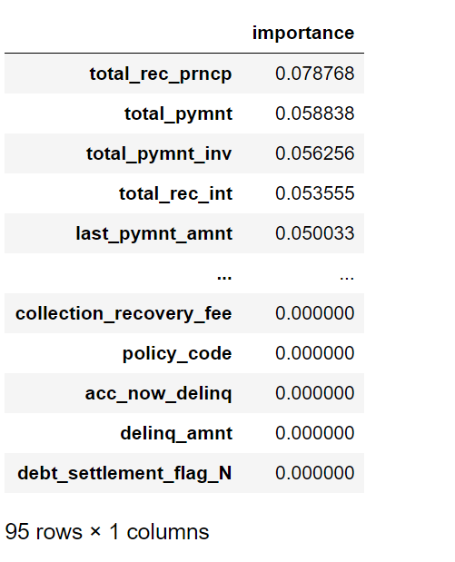
Figure 13

### Easy Ensemble AdaBoost Classifier
Boosting also combines week learners but it combines them sequentially so they learn as they go. The sample split,  based on y_train is the same as the balanced random forest classifier. See figure 14. Also, notice we again used 100 estimators.
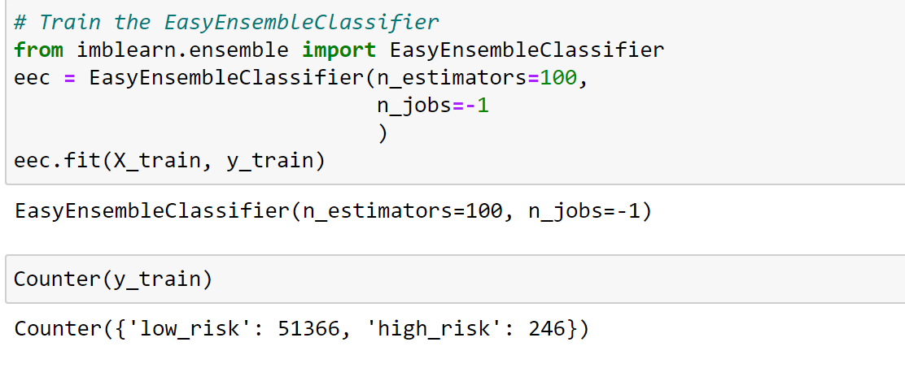

Figure 14
The results are shown in figure 15.
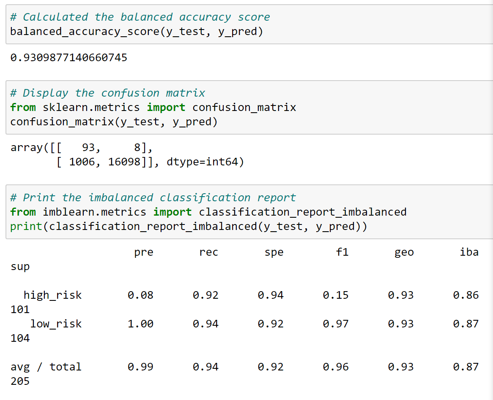
Figure 15
The rounded balanced accuracy score is 0.93. Now, this is the best score.  Looking at the classification report the precision has improved to 0.08. Though still low, it is much higher than any of the other models.  Looking at the confusion matrix, out of 101 true high risk indicators, the model picked 93 of those and also picked 1006 as high risk that were false positives. This is the least false positives of any of the models.
Sensitivity has also improved. It is 0.92. Out of 17,104 truly low risk indicators, the model picked 16,098 correctly as negative and only 8 incorrectly, false negatives. The f1 score has also improved. It is 0.18. Again, this model is more sensitive then it is precise but overall, it is a good fit and the best fit of any of the models.

## Summary
In summary, the following 6 models, along with their balanced accuracy sores, were tried:
1. Naive Random Oversampling - 0.67
2. SMOTE Oversampling - 0.66
3. Under sampling - 0.56
4. Combination Over and Under Sampling - 0.68
5. Balanced Random Forest Classifier - 0.79
6. Easy Ensemble AdaBoost Classifier - 0.93
Based on this analysis I recommend the Easy Ensemble AdaBoost Classifier. In regards to precision vs sensitivity, it is an assumption that precision is more important then sensitivity. It is important to lend as this is how the bank makes it's money. Thus, denying loans to a low risk person who was incorrectly classified as high risk is lost opportunity. Having said that, there is definitely a cost to loans that go bad. I do not have the information necessary to understand the cost of bad loans but I also recommend this be analyzed and compared to the lost opportunity cost of mis-classifying low risk loans as high risk.

